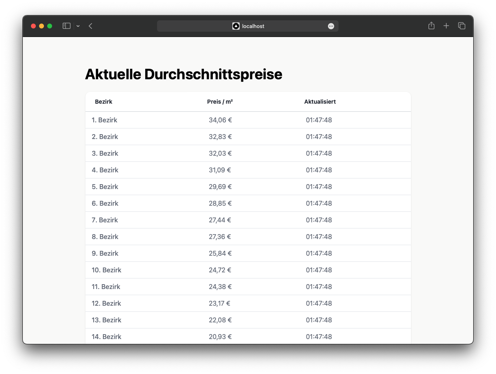

# Software Frameworks


App to display the average square meter price of each district in Vienna in realtime. Built using Kafka, Redis, Next, TypeScript and Java. 




## Start

```
docker compose up -d --build
```
